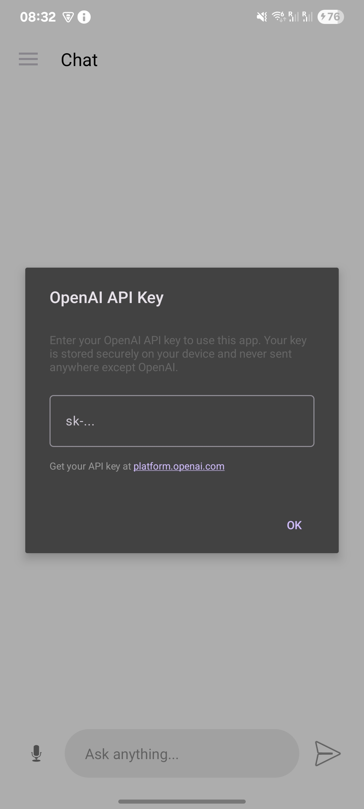
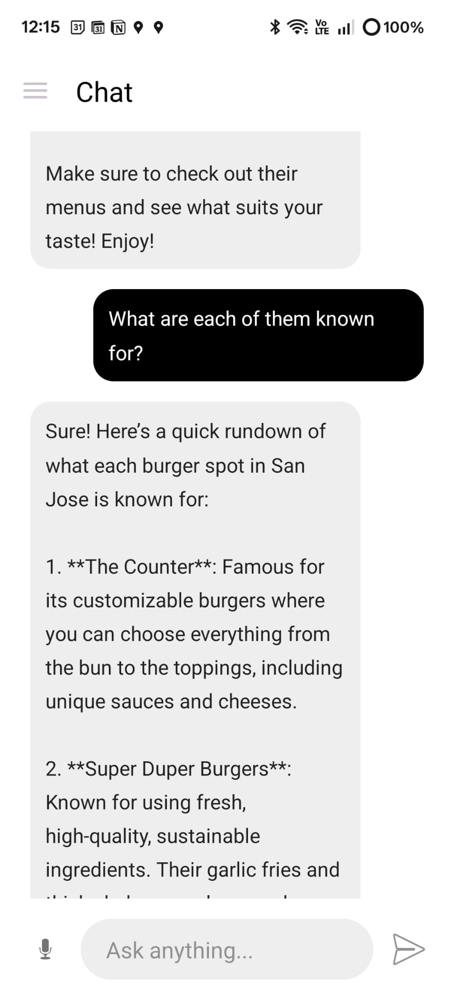
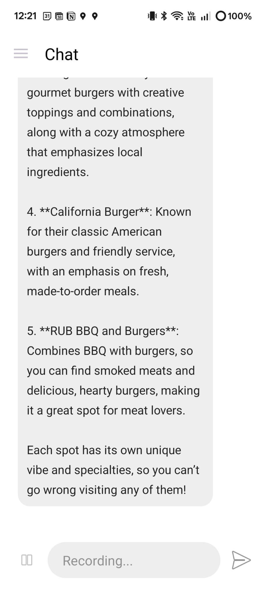
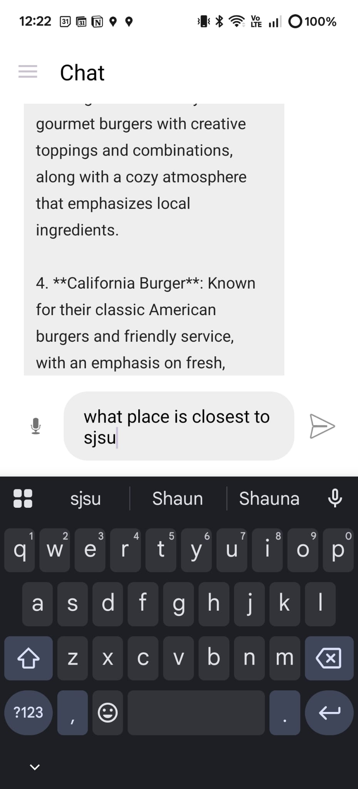
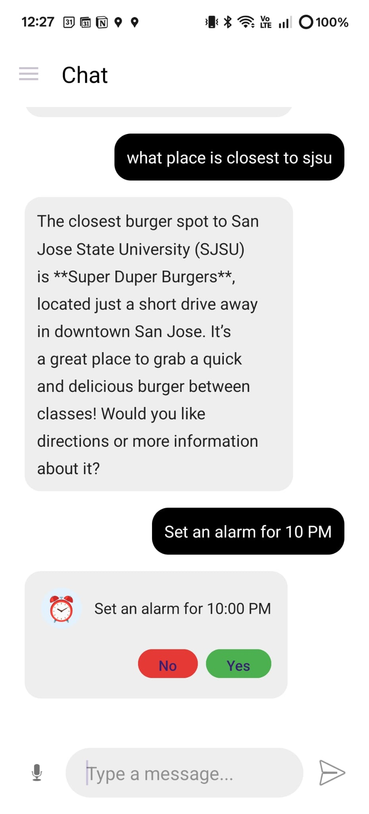
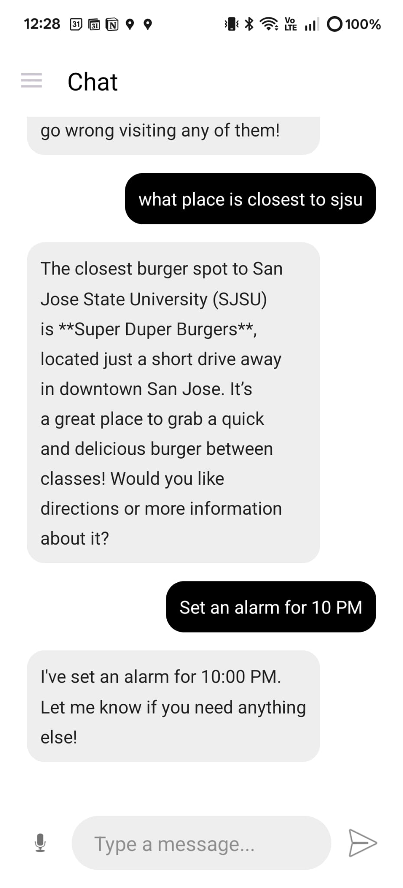
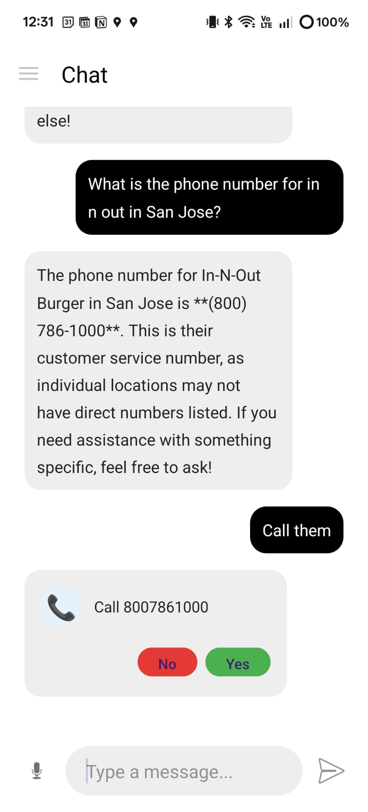
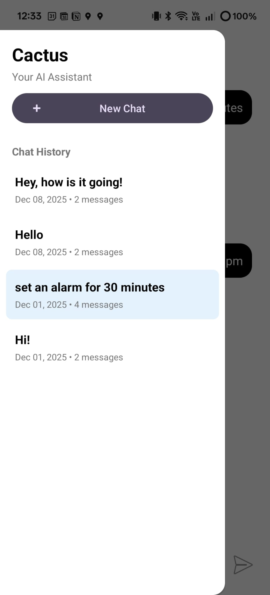
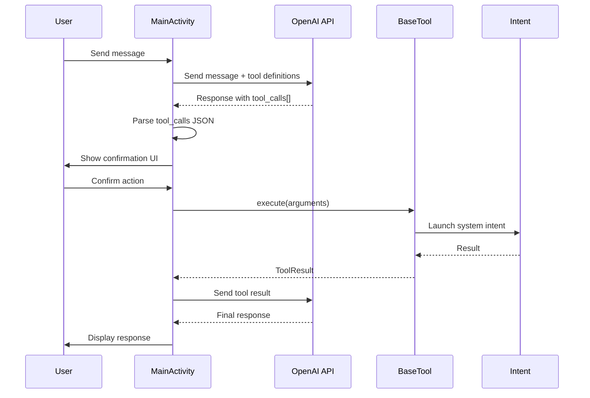
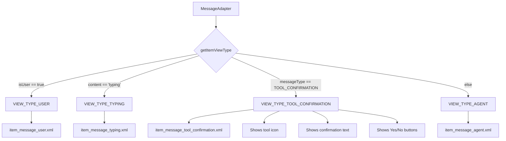

# Peyote - A Chat Interface with Access to the phone
Abhi Jain, Faiz Sameer Ahmed, Kaizen
___

## Resources
- The APK for Cactus is available in the repository under [./outputs/cactus-final.apk](./outputs/cactus-final.apk)
- The backlog can be found [here](https://docs.google.com/spreadsheets/d/1g8zk257sQ8Gk5N2L9-miorB-zEK8jFMDwh5rHLKlQrU/edit?usp=sharing).


## Hardware Requirements
- **Android Device:** Android 7.0 (API 24) or higher
- **RAM:** Minimum 2GB, recommended 4GB or more for optimal performance
- **Network:** Active internet connection required
- **Permissions Required:**
  - Microphone access (for voice input)
  - Internet access (for API calls)
  - Alarm permissions (for alarm setting functionality)

## User Guide

### Set Your API Key


- On first launch, you'll be prompted to enter your OpenAI API key
- Your key is stored securely on your device and never sent anywhere except OpenAI
- Get your API key at [platform.openai.com](https://platform.openai.com)
<br />

### Chat with the LLM


- Chat with GPT-4o Mini to get information and answers to your questions
- Uses ChatGPT API to power the chats
<br />
### Live Narration Feature



- Uses the mic to live transcode voice to text.
<br />
### Set Alarms through Chat



- Set alarms directly through the chat interface
<br />

### Phone Calls


- Can also make phone calls through the app

<br />

### Persistent Sessions


- Refer to previous conversations and continue from there.
- Start new conversations and keep the context separated.

## Technical Details

### Tool Calling Architecture

The app implements OpenAI function calling to enable the LLM to interact with Android system features.




### RecyclerView Message Types

The chat interface uses a single `RecyclerView` with multiple view types to display different message states.



**Message Type Implementation:**

```java
@Override
public int getItemViewType(int position) {
    Message message = messages.get(position);
    if (message.isUser()) {
        return VIEW_TYPE_USER;
    } else if (message.getContent().equals("typing")) {
        return VIEW_TYPE_TYPING;
    } else if (message.getMessageType() == Message.TYPE_TOOL_CONFIRMATION) {
        return VIEW_TYPE_TOOL_CONFIRMATION;
    } else {
        return VIEW_TYPE_AGENT;
    }
}
```

**Tool Confirmation Display:**

When a tool call is detected, a special message type is added to the adapter:
```java
// Create confirmation message
Message confirmMessage = new Message(confirmationText, Message.TYPE_TOOL_CONFIRMATION);
confirmMessage.setToolCallData(toolCallObj);  // Store for later execution
messageAdapter.addMessage(confirmMessage);

// Bind confirmation UI with tool icon
if (message.getMessageType() == Message.TYPE_TOOL_CONFIRMATION) {
    holder.toolConfirmationText.setText(message.getContent());
    
    // Set icon based on tool type
    switch (toolName) {
        case "set_alarm": holder.toolIcon.setText("⏰"); break;
        case "make_call": holder.toolIcon.setText("📞"); break;
    }
    
    // Handle button clicks
    holder.btnYes.setOnClickListener(v -> {
        confirmationListener.onToolConfirmed(message, position);
    });
}
```

The adapter maintains a single list but renders different layouts based on message type, allowing seamless integration of system interactions within the conversation flow.
